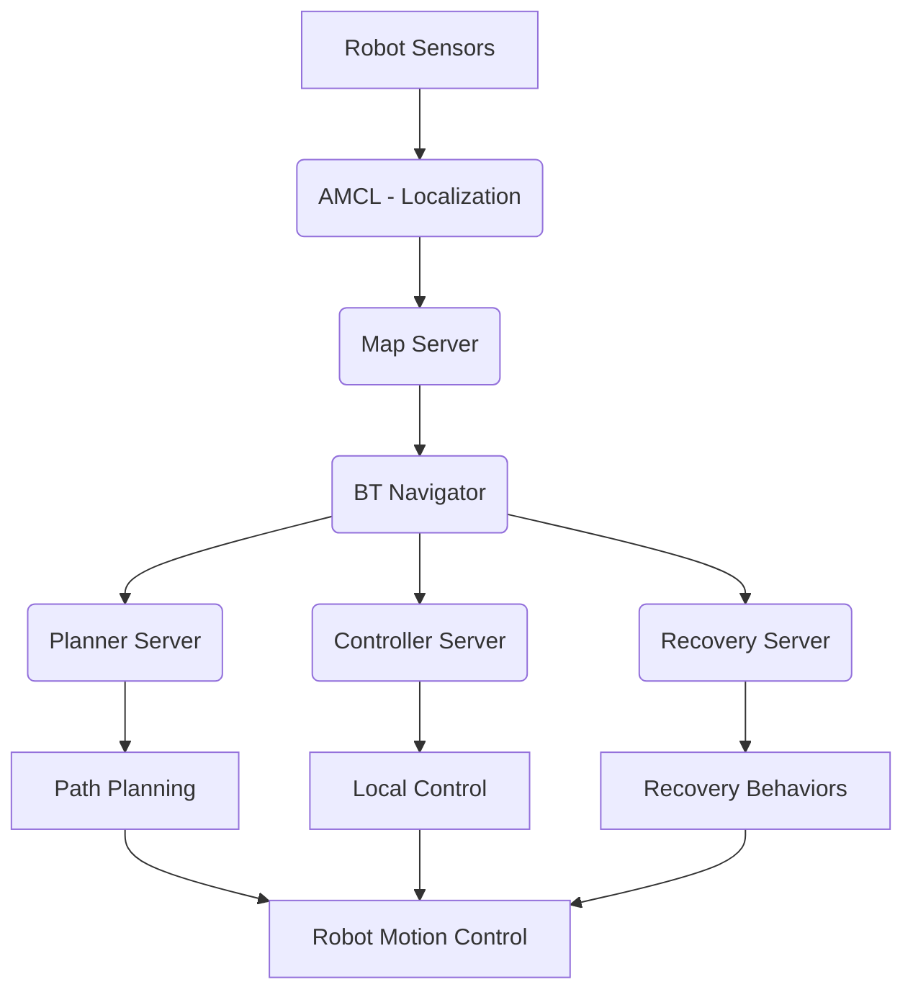

# Navigation Stack Integration

## Overview

The ROS 2 Navigation Stack provides a comprehensive framework for robot navigation, including path planning, obstacle avoidance, localization, and mapping capabilities. This section covers how to integrate navigation functionality into your robotic systems.

## Navigation 2 Stack Architecture

The Navigation 2 stack is built on several core components:

### Core Components

1. **Navigation Lifecycle Manager**: Coordinates the lifecycle of all navigation nodes
2. **Planner Server**: Provides global path planning (Navfn, A*, etc.)
3. **Controller Server**: Handles local path following and obstacle avoidance
4. **Recovery Server**: Manages recovery behaviors when navigation fails
5. **BT Navigator**: Behavior Tree-based navigation executor
6. **Amcl**: Adaptive Monte Carlo Localization for pose estimation

### System Integration



## Setting Up Navigation

### Installation

```bash
# Install navigation packages
sudo apt update
sudo apt install ros-humble-navigation2 ros-humble-nav2-bringup
```

### Basic Navigation Package Structure

```
robot_navigation/
├── config/
│   ├── nav2_params.yaml
│   ├── map.yaml
│   └── rviz_config.rviz
├── launch/
│   └── navigation_launch.py
├── maps/
│   └── my_map.yaml
└── package.xml
```

## Configuration Files

### Navigation Parameters (nav2_params.yaml)

```yaml
amcl:
  ros__parameters:
    use_sim_time: False
    alpha1: 0.2
    alpha2: 0.2
    alpha3: 0.2
    alpha4: 0.2
    alpha5: 0.2
    base_frame_id: "base_footprint"
    beam_skip_distance: 0.5
    beam_skip_error_threshold: 0.9
    beam_skip_threshold: 0.3
    do_beamskip: false
    global_frame_id: "map"
    lambda_short: 0.1
    laser_likelihood_max_dist: 2.0
    laser_max_range: 100.0
    laser_min_range: -1.0
    laser_model_type: "likelihood_field"
    max_beams: 60
    max_particles: 2000
    min_particles: 500
    odom_frame_id: "odom"
    pf_err: 0.05
    pf_z: 0.99
    recovery_alpha_fast: 0.0
    recovery_alpha_slow: 0.0
    resample_interval: 1
    robot_model_type: "nav2_amcl::DifferentialMotionModel"
    save_pose_rate: 0.5
    sigma_hit: 0.2
    tf_broadcast: true
    transform_tolerance: 1.0
    update_min_a: 0.2
    update_min_d: 0.25
    z_hit: 0.5
    z_max: 0.05
    z_rand: 0.5
    z_short: 0.05

planner_server:
  ros__parameters:
    expected_planner_frequency: 20.0
    planner_plugins: ["GridBased"]
    GridBased:
      plugin: "nav2_navfn_planner/NavfnPlanner"
      tolerance: 0.5
      use_astar: false
      allow_unknown: true

controller_server:
  ros__parameters:
    controller_frequency: 20.0
    min_x_velocity_threshold: 0.001
    min_y_velocity_threshold: 0.5
    min_theta_velocity_threshold: 0.001
    controller_plugins: ["FollowPath"]
    FollowPath:
      plugin: "nav2_mppi_controller/MppiController"
      time_steps: 20
      control_frequency: 20.0
      vx_samples: 20
      vy_samples: 5
      wz_samples: 20
      xy_goal_tolerance: 0.25
      yaw_goal_tolerance: 0.25
      stateful: true
      critics: ["BaseObstacleCritic", "GoalCritic", "PathAlignCritic", "PathDistCritic", "PathAngleCritic", "PreferForwardCritic"]
      BaseObstacleCritic:
        plugin: "nav2_mppi_controller::BaseObstacleCritic"
        threshold_to_recover_from_oscillation: 0.1
      GoalCritic:
        plugin: "nav2_mppi_controller::GoalCritic"
        goal_dist_thresh: 1.0
      PathAlignCritic:
        plugin: "nav2_mppi_controller::PathAlignCritic"
        cost_power: 1
        cost_weight: 3.0
        threshold_to_consider_path_alignment: 0.3
      PathDistCritic:
        plugin: "nav2_mppi_controller::PathDistCritic"
        cost_power: 1
        cost_weight: 1.0
      PathAngleCritic:
        plugin: "nav2_mppi_controller::PathAngleCritic"
        cost_power: 1
        cost_weight: 3.0
        threshold_to_consider_path_direction: 0.3
      PreferForwardCritic:
        plugin: "nav2_mppi_controller::PreferForwardCritic"
        cost_power: 1
        cost_weight: 2.0
        threshold_angle: 0.3
```

## Launch File Configuration

### Navigation Launch File (navigation_launch.py)

```python
from launch import LaunchDescription
from launch.actions import DeclareLaunchArgument, SetEnvironmentVariable
from launch.substitutions import LaunchConfiguration
from launch_ros.actions import Node
from nav2_common.launch import RewrittenYaml


def generate_launch_description():
    # Launch arguments
    namespace = LaunchConfiguration('namespace')
    use_sim_time = LaunchConfiguration('use_sim_time')
    autostart = LaunchConfiguration('autostart')
    params_file = LaunchConfiguration('params_file')
    default_bt_xml_filename = LaunchConfiguration('default_bt_xml_filename')
    map_subscribe_transient_local = LaunchConfiguration('map_subscribe_transient_local')

    # Launch arguments declaration
    declare_namespace_cmd = DeclareLaunchArgument(
        'namespace',
        default_value='',
        description='Top-level namespace')

    declare_use_sim_time_cmd = DeclareLaunchArgument(
        'use_sim_time',
        default_value='false',
        description='Use simulation (Gazebo) clock if true')

    declare_autostart_cmd = DeclareLaunchArgument(
        'autostart',
        default_value='true',
        description='Automatically startup the nav2 stack')

    declare_params_file_cmd = DeclareLaunchArgument(
        'params_file',
        default_value='config/nav2_params.yaml',
        description='Full path to the ROS2 parameters file to use for all launched nodes')

    declare_bt_xml_cmd = DeclareLaunchArgument(
        'default_bt_xml_filename',
        default_value='config/navigate_w_replanning_and_recovery.xml',
        description='Full path to the behavior tree xml file to use')

    declare_map_subscribe_transient_local_cmd = DeclareLaunchArgument(
        'map_subscribe_transient_local',
        default_value='true',
        description='Whether to set the map subscriber QoS to transient local')

    # Create our own temporary YAML files that include substitutions
    param_substitutions = {
        'use_sim_time': use_sim_time,
        'default_bt_xml_filename': default_bt_xml_filename,
        'autostart': autostart,
        'map_subscribe_transient_local': map_subscribe_transient_local}

    configured_params = RewrittenYaml(
        source_file=params_file,
        root_key=namespace,
        param_rewrites=param_substitutions,
        convert_types=True)

    # Navigation lifecycle manager
    lifecycle_manager_cmd = Node(
        package='nav2_lifecycle_manager',
        executable='lifecycle_manager',
        name='lifecycle_manager_navigation',
        namespace=namespace,
        output='screen',
        parameters=[{'use_sim_time': use_sim_time},
                   {'autostart': autostart},
                   {'node_names': ['map_server',
                                   'planner_server',
                                   'controller_server',
                                   'behavior_server',
                                   'bt_navigator',
                                   'waypoint_follower',
                                   'velocity_smoother']}])

    # Launch the ROS 2 Navigation Stack
    return LaunchDescription([
        declare_namespace_cmd,
        declare_use_sim_time_cmd,
        declare_autostart_cmd,
        declare_params_file_cmd,
        declare_bt_xml_cmd,
        declare_map_subscribe_transient_local_cmd,
        lifecycle_manager_cmd])
```

## Integration Example

### Creating a Navigation Node

```python
import rclpy
from rclpy.action import ActionClient
from rclpy.node import Node
from geometry_msgs.msg import PoseStamped
from nav2_msgs.action import NavigateToPose

class NavigationNode(Node):

    def __init__(self):
        super().__init__('navigation_node')

        # Create action client for navigation
        self.nav_to_pose_client = ActionClient(
            self,
            NavigateToPose,
            'navigate_to_pose')

        # Wait for action server to be available
        self.nav_to_pose_client.wait_for_server()

        # Create publisher for initial pose
        self.initial_pose_pub = self.create_publisher(
            PoseStamped,
            'initialpose',
            10)

        # Create publisher for goal pose
        self.goal_pose_pub = self.create_publisher(
            PoseStamped,
            'goal_pose',
            10)

    def send_goal_pose(self, x, y, theta):
        """Send a goal pose to the navigation stack"""
        goal_msg = NavigateToPose.Goal()
        goal_msg.pose.header.frame_id = 'map'
        goal_msg.pose.header.stamp = self.get_clock().now().to_msg()

        # Set position
        goal_msg.pose.pose.position.x = x
        goal_msg.pose.pose.position.y = y
        goal_msg.pose.pose.position.z = 0.0

        # Convert theta (yaw) to quaternion
        from math import sin, cos
        goal_msg.pose.pose.orientation.x = 0.0
        goal_msg.pose.pose.orientation.y = 0.0
        goal_msg.pose.pose.orientation.z = sin(theta / 2.0)
        goal_msg.pose.pose.orientation.w = cos(theta / 2.0)

        # Send goal
        self.nav_to_pose_client.wait_for_server()
        future = self.nav_to_pose_client.send_goal_async(goal_msg)
        return future

    def set_initial_pose(self, x, y, theta):
        """Set the initial pose for localization"""
        pose_msg = PoseStamped()
        pose_msg.header.frame_id = 'map'
        pose_msg.header.stamp = self.get_clock().now().to_msg()

        # Set position
        pose_msg.pose.position.x = x
        pose_msg.pose.position.y = y
        pose_msg.pose.position.z = 0.0

        # Convert theta (yaw) to quaternion
        from math import sin, cos
        pose_msg.pose.orientation.x = 0.0
        pose_msg.pose.orientation.y = 0.0
        pose_msg.pose.orientation.z = sin(theta / 2.0)
        pose_msg.pose.orientation.w = cos(theta / 2.0)

        self.initial_pose_pub.publish(pose_msg)

def main(args=None):
    rclpy.init(args=args)
    nav_node = NavigationNode()

    # Set initial pose (example: at origin)
    nav_node.set_initial_pose(0.0, 0.0, 0.0)

    # Send navigation goal (example: move to x=5, y=5)
    future = nav_node.send_goal_pose(5.0, 5.0, 0.0)

    try:
        rclpy.spin(nav_node)
    except KeyboardInterrupt:
        pass
    finally:
        nav_node.destroy_node()
        rclpy.shutdown()

if __name__ == '__main__':
    main()
```

## Behavior Trees for Navigation

Behavior trees provide a flexible way to define complex navigation behaviors:

```xml
<root main_tree_to_execute="MainTree">
    <BehaviorTree ID="MainTree">
        <RecoveryNode number_of_retries="6" name="NavigateRecovery">
            <PipelineSequence name="NavigateWithReplanning">
                <RateController hz="1.0">
                    <ComputePathToPose goal="{goal}" path="{path}" planner_id="GridBased"/>
                </RateController>
                <RecoveryNode number_of_retries="1" name="FollowPathRecovery">
                    <FollowPath path="{path}" controller_id="FollowPath"/>
                    <ReactiveFallback name="FollowPathWithRecovery">
                        <GoalReached goal="{goal}"/>
                        <PathFollowed path="{path}"/>
                        <RecoveryNode number_of_retries="2" name="spin">
                            <Spin spin_dist="1.57"/>
                        </RecoveryNode>
                    </ReactiveFallback>
                </RecoveryNode>
            </PipelineSequence>
            <ReactiveFallback name="RecoveryFallback">
                <GoalUpdated/>
                <RecoveryNode number_of_retries="2" name="backup">
                    <BackUp backup_dist="0.15" backup_speed="0.025"/>
                </RecoveryNode>
            </ReactiveFallback>
        </RecoveryNode>
    </BehaviorTree>
</root>
```

## Map Server Integration

```python
import rclpy
from rclpy.node import Node
from nav_msgs.srv import GetMap

class MapIntegrationNode(Node):

    def __init__(self):
        super().__init__('map_integration_node')

        # Create client for map service
        self.map_client = self.create_client(GetMap, 'map')

        # Wait for map service to be available
        while not self.map_client.wait_for_service(timeout_sec=1.0):
            self.get_logger().info('Map service not available, waiting again...')

    def get_map(self):
        """Request the current map from the map server"""
        request = GetMap.Request()
        future = self.map_client.call_async(request)
        return future

def main(args=None):
    rclpy.init(args=args)
    map_node = MapIntegrationNode()

    # Request the map
    future = map_node.get_map()

    try:
        rclpy.spin_until_future_complete(map_node, future)
        response = future.result()
        map_info = response.map.info
        map_data = response.map.data

        map_node.get_logger().info(f'Map resolution: {map_info.resolution}')
        map_node.get_logger().info(f'Map size: {map_info.width} x {map_info.height}')

    except KeyboardInterrupt:
        pass
    finally:
        map_node.destroy_node()
        rclpy.shutdown()

if __name__ == '__main__':
    main()
```

## Best Practices for Navigation Integration

1. **Localization**: Ensure proper localization before navigation
2. **Safety**: Implement safety checks and emergency stops
3. **Map Quality**: Use high-quality maps for reliable navigation
4. **Parameter Tuning**: Fine-tune navigation parameters for your specific robot
5. **Testing**: Test navigation in simulation before real-world deployment
6. **Recovery Behaviors**: Implement appropriate recovery behaviors for your environment

## Troubleshooting Common Issues

- **Localization Failures**: Check sensor data quality and map accuracy
- **Path Planning Failures**: Verify map is properly loaded and robot footprint is correct
- **Controller Issues**: Check velocity limits and control frequency
- **Oscillation**: Adjust controller parameters or add anti-oscillation behaviors

## References

[All sources will be cited in the References section at the end of the book, following APA format]